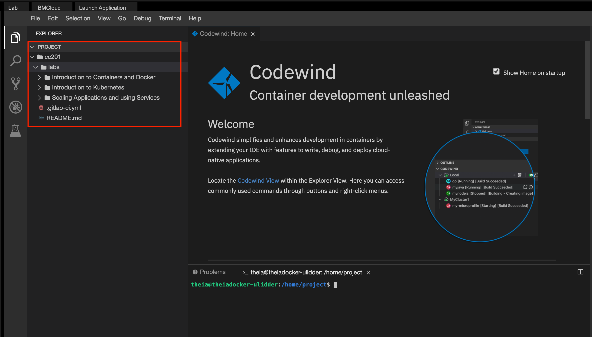

# Scaling Applications and using Services

## Objectives

In this lab, you will:
- Scale an application using relicaset
- Apply rolling updates to an application
- Use configmaps and secrets to store information
- Bind an external service to an application

# Clone the repository
1. You can skip this step if you have already cloned the repository for the previous lab. Otherwise, clone the labs using the following commands:
   ```
   git clone https://gitlab.com/ibm/skills-network/courses/cc201.git
   ```
   If you now open the Explorer panel on the left, you will see the `cc201` directory listed:
   
2. We will perform the remainder of this lab in the terminal. If you don't have it open at the bottom, you can start a new terminal by clicking on `Terminal > New Terminal`. Once the terminal is open, change to the labs directory:
   ```
   cd cc201/labs/
   ```
3. You will see the following subdirectories: 
   ```
   'Introduction to Kubernetes'
   'Introduction to Containers and Docker'
   'Scaling Applications and using Services'
   ```
4. Change to the `Scaling Applications and using Services` directory for this lab
   ```
   cd Scaling\ Applications\ and\ using\ Services/
   ```

# Build and and upload application image to IBM Container Registry
1. Change directory to `express`
   ```
      cd express
   ```
2. As part of the environment, you are already signed into a temporary IBM Cloud account. Let's list all the namespaces in IBM Cloud Container Registry in this temporary account:
   ```
   ibmcloud cr namespace-list
   ```
   Take a note of the namespace. You can see below the namespace for this account is `sn-labs-ulidder `. You wil need this later.
   ```
   Listing namespaces for account 'QuickLabs - IBM Skills Network' in registry 'us.icr.io'...

   Namespace   
   sn-labs-ulidder   

   OK
   ```
3. Build the container image with a `1` tag and push the image to the IBM Cloud Registry. Replace `<my_namespace>` with the namespace you copied in the previous step:

   ```ibmcloud cr build --tag us.icr.io/<my_namespace>/hello-world:1 .```

   You will see output as follows with an `OK` message at the bottom

   ```
   Sending build context to Docker daemon  6.144kB
   Step 1/6 : FROM node:9.4.0-alpine
   ---> b5f94997f35f
   Step 2/6 : COPY app.js .
   ---> Using cache
   ---> 40e9cd89e833
   Step 3/6 : COPY package.json .
   ---> Using cache
   ---> 15f1588bed53
   Step 4/6 : RUN npm install &&    apk update &&    apk upgrade
   ---> Using cache
   ---> 57fe2d2d8b51
   Step 5/6 : EXPOSE  8080
   ---> Using cache
   ---> ff985cb71eea
   Step 6/6 : CMD node app.js
   ---> Using cache
   ---> d19a3df0ef1a
   Successfully built d19a3df0ef1a
   Successfully tagged private.us.icr.io/sn-labs-ulidder/hello-world:1
   The push refers to repository [private.us.icr.io/sn-labs-ulidder/hello-world]
   232a31728dab: Pushed 
   d04e5c2bbddf: Pushed 
   2f66a450ccb8: Pushed 
   0804854a4553: Pushed 
   6bd4a62f5178: Pushed 
   9dfa40a0da3b: Pushed 
   1: digest: sha256:9031783c9cd3ba3a41ed45edf63419e515ca9546817355e522e1e2d87bba9380 size: 1576

   OK
   ```
   We will use this image in your IBM Cloud Container Registry to deploy the express application on the cluster in the next step.
   
# Deploy the application
1. Start by running your image as a deployment. We have provided a sample deploy.yaml file in the express directory for your convenience. Remember to replace `<my_namespace>` with your own namespace and then run: 
   ```
      kubectl apply -f deploy.yaml
   ```

   You should see an output similar to this:
   ```
   deployment.apps/hello-world created
   ```
2. To check the status of your deployment, you can use `kubectl get deployment`.

   You should see output similar to the following:
   
   ```
   NAME          READY   UP-TO-DATE   AVAILABLE   AGE
   hello-world   1/1     1            1           12s
   ```

3. You can look at the pods using the `kubectl get pods` commands as before. 
   ```

   ```
4. Once the status reads `Running`, expose that deployment as a service, accessed through the IP of the worker nodes.  The example for this course listens on port 8080.  Run:

   ```kubectl expose deployment/hello-world --type="NodePort" --port=8080 --name hello-world-svc```

5. To find the port used on that worker node, examine your new service: 

   ```kubectl describe service hello-world-svc```

   You should see an output as follows:
   ```
   Name:                     hello-world-svc
   Namespace:                sn-labs-ulidder
   Labels:                   <none>
   Annotations:              <none>
   Selector:                 app=hello-world
   Type:                     NodePort
   IP:                       172.21.224.179
   Port:                     <unset>  8080/TCP
   TargetPort:               8080/TCP
   NodePort:                 <unset>  31801/TCP
   Endpoints:                <none>
   Session Affinity:         None
   External Traffic Policy:  Cluster
   Events:                   <none>
   ```

   Take note of the "NodePort:" line as `<nodeport>`, listed as 31801 in the output above. The port number listed for you might be different.

6. We also need the IP our the single node in this cluster. The security policy in this temporary account does not let you ask for node details. However, we can get the IP from the pod details with the following command: 
   ```
   kubectl get pod -o=wide
   ```
   Sample output is shown here:
   ```
   NAME                          READY   STATUS    RESTARTS   AGE     IP               NODE            NOMINATED NODE   READINESS GATES
   hello-world-d7d7849fb-sb4x2   1/1     Running   0          5m30s   172.30.104.155   10.114.85.153   <none>           <none>
   ```
   Take note of the NODE IP. It is 10.114.85.153 in the output above.
7. We can now access our application using the node IP and the port number we obtained in the previous steps as follows:
   ```
   curl nodeip:port
   ```
   For the above steps, it will look like `curl 10.114.85.153:31801`. You should see an output like:
   ```
   Hello world from hello-world-d7d7849fb-sb4x2!
   ```
   The host name should reflect your pod name.
   
# Scaling the application using Replicaset
1. Now that you know how to deploy and access the application from the terminal, let's make sure we always have three copies of the application running different pods. This is very easy to do with the `scale` command:
   ```
   kubectl scale deploy hello-world --replicas=3
   ```
   You should see an output as follows:
   ```
   deployment.apps/hello-world scaled
   ```
2. You can check if the pods were actually scaled by using the `kubectl get pods` command again. You should see all the pods listed as shown here. Again the pod names might be different for your account:
   ```
   hello-world-d7d7849fb-dz2v7   1/1     Running   0          9s
   hello-world-d7d7849fb-nncz2   1/1     Running   0          9s
   hello-world-d7d7849fb-sb4x2   1/1     Running   0          10m
   ```
3. If you access your application now multiple times, you should see a different host name every now and then as the load balancer picks a different node to deliver the application. Here is a fun way to execute the curl command 10 times `for i in `seq 1 10`; do curl <nodeip>:<port> && echo ""; done`. Replace <nodeip> and <port> with your node IP and port. The output should look something like:
   ```
   Hello world from hello-world-d7d7849fb-sb4x2!
   Hello world from hello-world-d7d7849fb-nncz2!
   Hello world from hello-world-d7d7849fb-nncz2!
   Hello world from hello-world-d7d7849fb-nncz2!
   Hello world from hello-world-d7d7849fb-sb4x2!
   Hello world from hello-world-d7d7849fb-dz2v7!
   Hello world from hello-world-d7d7849fb-sb4x2!
   Hello world from hello-world-d7d7849fb-dz2v7!
   Hello world from hello-world-d7d7849fb-dz2v7!
   Hello world from hello-world-d7d7849fb-nncz2!
   ```
   As you can see, the host name is rotating between our three pods.

## AutoScaling the application
1. Instead of hard coding to a pre-determined number of pods, we can provide a min and max to kubectl command along with a set of constraints that will trigger additional pods. Here is an example:
   ```
   kubectl autoscale deploy hello-world --min=2 --max=5 --cpu-percent=10 
   ```
2. The autoscaling feature has been disabled in the lab environment at this time.

# Apply rolling updates
1. Rolling updates provide an easy way to update our application in an automated and controlled fashion. Remember, we first deployed our application using the image we built and pushed to IBM Cloud Container registry. Let's make a change to the application and push a new image with a tag of 2.
2. Open the `app.js` file in the editor and change the welcome message to 
   ```
   res.send('Hello world from ' + hostname)
   ```
   to 
   ```
   res.send('Welcome to ' + hostname)
   ```
3. Now, push this image back to ICR using the following command:
   ```
   ibmcloud cr build --tag us.icr.io/sn-labs-ulidder/hello-world:2 .
   ```
4. You can see the list of images by executing the following command:
   ```
   ibmcloud cr images
   ```
   You should see a list as shown here with the same image and tags 1 and 2:
   ```
   Listing images...

   Repository                              Tag   Digest         Namespace         Created         Size    Security status   
   us.icr.io/sn-labs-ulidder/hello-world   1     9031783c9cd3   sn-labs-ulidder   1 day ago       27 MB   No Issues   
   us.icr.io/sn-labs-ulidder/hello-world   2     7cd6b48c5a08   sn-labs-ulidder   2 minutes ago   27 MB   No Issues 
   ```
5. Let's update our deploy application to use this image instead:
   ```
   kubectl set image deployments/hello-world hello-world=us.icr.io/<my_namespace>/hello-world:2
   ```
   Replace `<my_namespace>` with your own namespace. You can list all namespaces by using the following command:
   ```
   ibmcloud cr namespace-list
   ```
6. You can use the IP and port from the previous section to curl the end point by using the following command:
   ```
   for i in `seq 1 10`; do curl node_ip:port && echo ""; done
   ```
   Replace `node_ip` and `port` accordingly. You should see output from all the replicas:
   ```
   Welcome to hello-world-f575d97dc-mwldb
   Welcome to hello-world-f575d97dc-4gjvn
   Welcome to hello-world-f575d97dc-mwldb
   Welcome to hello-world-f575d97dc-sj4qd
   Welcome to hello-world-f575d97dc-sj4qd
   Welcome to hello-world-f575d97dc-4gjvn
   Welcome to hello-world-f575d97dc-mwldb
   Welcome to hello-world-f575d97dc-sj4qd
   Welcome to hello-world-f575d97dc-sj4qd
   Welcome to hello-world-f575d97dc-4gjvn
   ```
7. You can get a status of the rolling update by using the following command:
   ```
   kubectl rollout status deployments/hello-world
   ```
   You should see an output like this:
   ```
   deployment "hello-world" successfully rolled out
   ```
8. You can also describe the deployment to see the image being used
   ```
   kubectl describe deploy hello-world | grep Image
   ```
   You should see the full image name with the tag:
   ```
   Image:        us.icr.io/sn-labs-ulidder/hello-world:2
   ```
9. Let's undo our update by using the following command:
    ```
    kubectl rollout undo deployments/hello-world                                       
    ```
10. If we now describe the deployment and grep for Image, we will see the image was rolled back to tag 1:
    ```
    Image:        us.icr.io/sn-labs-ulidder/hello-world:1
    ```

# Use configmaps and secrets to store information
1. Configmaps and secrets are used to store information outside the code so we don't hardcode anything. Let's store the message that the application returns back in a configmap. When we use the curl command, the application returns a message from app.js file as follows:
   ```
      app.get('/', function(req, res) {
         res.send('Welcome to ' + hostname + '\n')
      })
   ```
2. Let's extract the message `Welcome to` to a configmap. The easiest way to do this would be to use a string literal in the deployment file. Change the `deploy.yaml` file by adding the `env` section to the container as follows:
   ```
   apiVersion: apps/v1
   kind: Deployment
   metadata:
   name: hello-world
   spec:
   selector:
      matchLabels:
         app: hello-world
   template:
      metadata:
         labels:
         app: hello-world
      spec:
         containers:
         - name: hello-world
         image: us.icr.io/sn-labs-ulidder/hello-world:1 
         ports:
         - containerPort: 8080
         env:
         - name: MESSAGE
            value: "Greeting from "
         imagePullSecrets:
         - name: icr
   ```
3. In order to use this new configmap, change the `app.js` file as follows:
   ```
   app.get('/', function(req, res) {
      res.send(process.env.MESSAGE + ' ' + hostname)
   })
   ```
4. Since we changed the code, we need push this image back to IBM Cloud Container Registry with a new tag:
   ```
   ibmcloud cr build --tag us.icr.io/sn-labs-ulidder/hello-world:2 .
   ```
5. Finally, let's also change the deploy.yaml file as follows to grab this new image:
   ```
   image: us.icr.io/<my_namespace>/hello-world:3
   ```
   Please fill out <my_namespace> with your actual namespace.
7. Now, apply this new deploy.yaml file to our cluster:
   ```
   kubectl apply -f deploy.yaml
   ```
8. Finally, let's do the curl command again and see the output. You will need get the node ip and the port again if you dont' remember from the sections above.
   ```
   curl 10.114.85.153:30459 -w "\n"
   ```
   You will see an output as follows:
   ```
   Greeting from  hello-world-79f857647d-fjjws
   ```
   The `Greeting from` text is coming from the environment variable set in the deploy descriptor.

   TODO: extact the string to a properties file.

Congratulations! You have completed the first lab of this course.